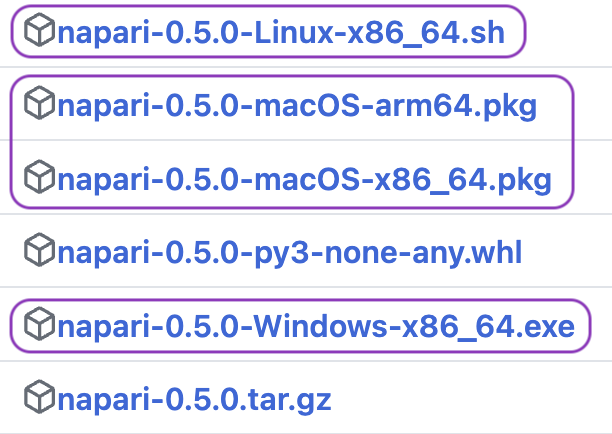
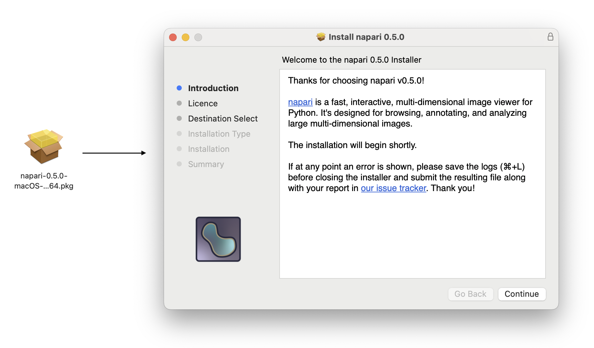
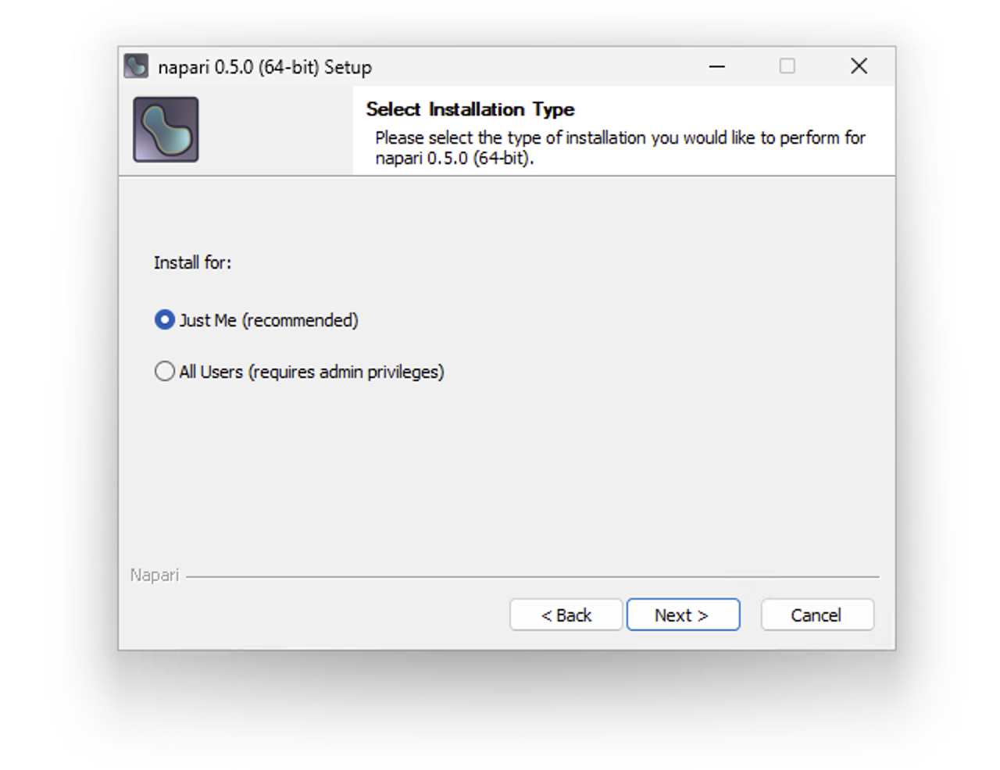
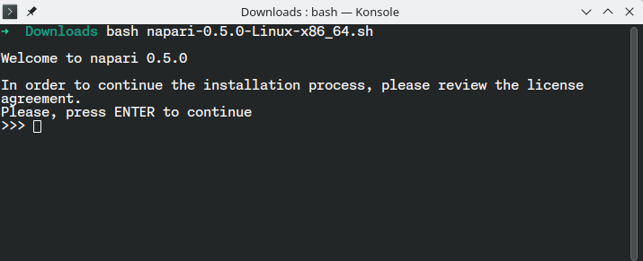
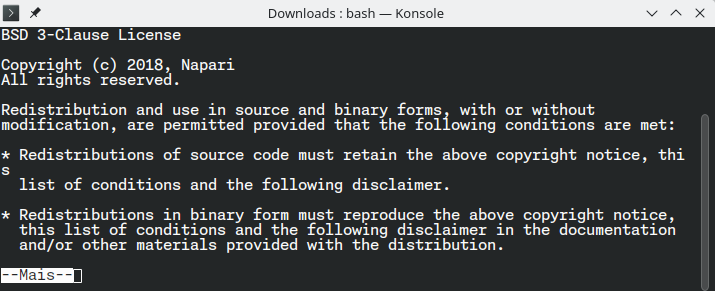
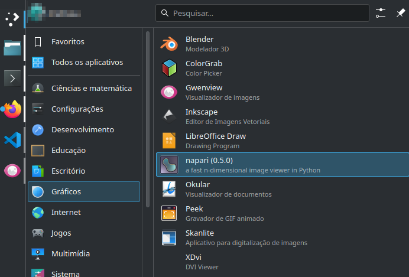

---
jupyter:
  jupytext:
    formats: ipynb,md
    text_representation:
      extension: .md
      format_name: markdown
      format_version: '1.3'
      jupytext_version: 1.13.0
  kernelspec:
    display_name: Python 3 (ipykernel)
    language: python
    name: python3
---

# How to install napari as a bundled app

napari can be installed as a bundled app on [MacOS](#how-to-install-the-macos-bundle), [Windows](#how-to-install-the-windows-bundle), and [Linux](#how-to-install-the-linux-bundle) with a simple one click download and guided installation process. This installation method is best if you mainly want to use napari as a standalone GUI app. However, certain plugins may not be supported.

```{note}
If you want to use napari from Python to programmatically interact with the app, please follow the [Python package installation guide](installation_python.md). This installation method is recommended to take full advantage of napari’s features and to access additional plugins. 
```

```{note} 
If you want to contribute code back into napari, please follow the [development installation instructions in the contributing guide](https://napari.org/developers/contributing.html).
```

To start, visit the [latest napari release page](https://github.com/napari/napari/releases/latest) and go to the ‘Assets’ tab and download the file that corresponds to your operating system. For MacOS users, download the file that corresponds to your processor (This can be checked by going to Apple menu > About This Mac. For Intel processors, download the x86 file, and for ARM processors, download the arm64 file.). Below are the installation guides for each operating system.



```{note} 
If you are interested in an earlier version of napari, you may access those files by scrolling below the latest release on the [napari release page](https://github.com/napari/napari/releases). The instructions below will work for napari versions 0.4.15 and above.
```

## Prerequisites

This installation method does not have any prerequisites. 

### How to Install the MacOS bundle

Once you have downloaded the appropriate MacOS package file, you will have a file with a name like ‘napari-0.4.15-macOS-x86_64.pkg’. Double click this file to open the installer.



Click ‘Continue’ to open the Software License Agreement.


After reading this agreement, click ‘Continue’ to be prompted to agree to the Software License Agreement in order to proceed with installation.


On the following page, you will be shown how much space the installation will use and can begin the standard installation by clicking ‘Install.’


However, if you would like to change the install location, you may specify a different location by clicking ‘Change Install Location…’ and following the subsequent prompts before starting the installation.

The installation progress can be monitored on the following window.


If installation is successful, you will see the window shown below and you may now close the installation wizard and move it to trash.


You can now get started using napari! Use Launchpad to open the application. 


```{note} 
The first time you open napari you must use the Launchpad, but subsequently, the napari application should show up in Spotlight search.
```

napari comes installed with sample images from scikit-image. Use the dropdown menu File > Open Sample > napari to open a sample image, or open one of your own images using File > Open or dragging and dropping your image onto the canvas. 

Next check out our [tutorial on the viewer](https://napari.org/tutorials/fundamentals/viewer.html) or explore any of the pages under the [Usage tab](https://napari.org/usage.html).

### How to Install the Windows bundle

Once you have downloaded the Windows executable file, you will have a file with a name like `napari-0.4.15-Windows-x86_64.exe`. Double click this file to open the napari Setup Wizard. Click "Next" to continue.


To continue, read and agree to the License Agreement by clicking ‘I Agree’.
 


The recommended installation method is to install napari just for the current user. 



Next you will be shown how much space will be used by the installation and the default destination folder, which can be updated using the ‘Browse’ button. Click ‘Next’ to continue.


On the next page, click ‘Install’ to start the installation process. Installation progress can be monitored on the following page.


Once installation is complete, you will see the page below. Click ‘Finish’ to close the installation wizard.


You can now get started using napari! A shortcut to launch napari can be found in the Windows Start menu. 

napari comes installed with sample images from scikit-image. Use the dropdown menu File>Open Sample>napari to open a sample image, or open one of your own images using File > Open or dragging and dropping your image onto the canvas. 

Next check out our [tutorial on the viewer](https://napari.org/tutorials/fundamentals/viewer.html) or explore any of the pages under the [Usage tab](https://napari.org/usage.html).

### How to Install the Linux bundle

Once you have downloaded the Linux SH file, you will have a file with a name like `napari-0.4.15-Linux-x86_64.sh`. Double click this file to open the command in terminal or open terminal and run the command ‘bash [file name]’.


Press Enter to open the License Agreement.



Read through the agreement shown below. You must agree to the terms by entering ‘yes’ to continue.




Next you will be shown the default location for the installation. You may confirm this location by hitting ENTER or specify a different location by writing out the filetree, which will begin the installation process. 


If installation is successful, you will see ‘installation finished.’ in terminal.


You can now get started using napari! A shortcut to launch napari should appear on your desktop or you can search for napari with the desktop searchbar.




napari comes installed with sample images from scikit-image. Use the dropdown menu File>Open Sample>napari to open a sample image, or open one of your own images using File > Open or dragging and dropping your image onto the canvas. 

Next check out our [tutorial on the viewer](https://napari.org/tutorials/fundamentals/viewer.html) or explore any of the pages under the [Usage tab](https://napari.org/usage.html).
